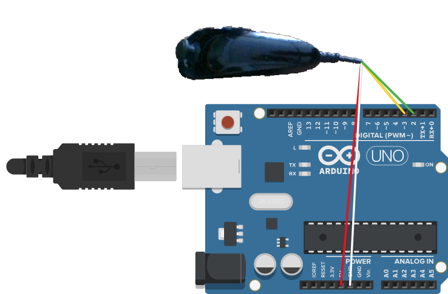
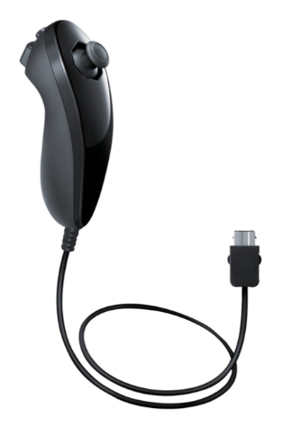

@author Daniel Gil

# Arduino-Wii-Nunchuk

Projetos em Arduino, que utiliza um velho controlador da wii(Nunchuk), que pode atuar como um joystick para jogos, ou então como um simples rato/mouse.

### Protocolo I²C (Inter-Integrated Circuit)
Protocolo de comunicação serial síncrono que permite a comunicação entre múltiplos dispositivos em distâncias curtas, utilizando apenas dois fios utilizei a biblioteca "Wire" (https://github.com/arduino/ArduinoCore-avr/tree/master/libraries/Wire)

### Joystick
Biblioteca "Arduino Joystick Library" (https://github.com/MHeironimus/ArduinoJoystickLibrary.git)

### Rato/Mouse
Biblioteca "Mouse" (https://github.com/arduino-libraries/Mouse)

### Esquema de ligação:

### Ligação:

### Controlador reciclado Wii-Nunchuck:

